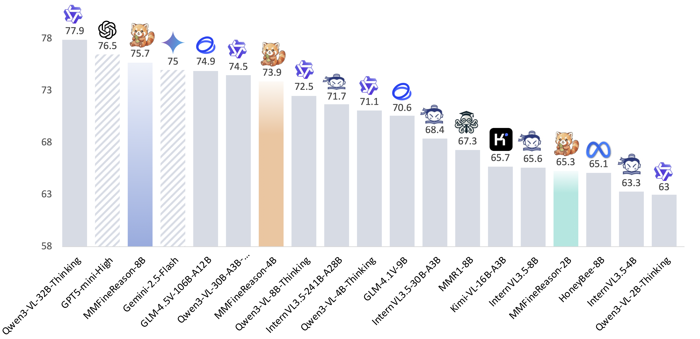

# MMFineReason: Closing the Multimodal Reasoning Gap via Open Data-Centric Methods

**[English](README.md)** | **[中文](README_zh.md)**

> [[论文]](https://arxiv.org/abs/2601.21821) | [[完整数据集 (2.3M)]](https://huggingface.co/datasets/OpenDataArena/MMFineReason-Full-2.3M-Qwen3-VL-235B-Thinking) | [[SFT + RL (1.8M)]](https://huggingface.co/datasets/OpenDataArena/MMFineReason-1.8M) | [[SFT (586K)]](https://huggingface.co/datasets/OpenDataArena/MMFineReason-SFT-586K) | [[SFT (123K)]](https://huggingface.co/datasets/OpenDataArena/MMFineReason-SFT-123K)

本代码库实现了 MMFineReason 论文中描述的完整数据构建 Pipeline，用于构建大规模高质量多模态推理数据集（1.8M 样本，5.1B solution tokens）。Pipeline 分为四个阶段：**Collection → Cleaning → Distillation → Selection**。

## 模型性能



上图展示了本项目模型（Qwen3-VL-8B/32B-SFT）在 MMFineReason 验证集上的表现，与 GPT-4V、Gemini Ultra、Qwen-VL 等主流多模态模型进行对比。可以看到，SFT 后的 Qwen3-VL-32B-Thinking 在多模态推理任务上取得了显著提升，甚至超越部分闭源商用模型，验证了大规模开放数据与链式推理标注的有效性。

## Overview

```
┌─────────────────────────────────────────────────────────────────────────┐
│                        MMFineReason Pipeline                           │
│                                                                        │
│  ┌──────────┐    ┌──────────┐    ┌──────────────┐    ┌───────────┐    │
│  │Collection│───▶│ Cleaning │───▶│ Distillation │───▶│ Selection │    │
│  └──────────┘    └──────────┘    └──────────────┘    └───────────┘    │
│                                                                        │
│  HF数据集下载     文本/图像清洗     CoT蒸馏+Caption    质量+难度过滤    │
│  (已处理好)       语言标准化        四阶段推理框架      内容/结构过滤    │
│                   指令精炼          视觉描述生成        N-gram去重       │
│                   任务适用性过滤                        正确性验证       │
│                                                        难度感知筛选     │
│                                                                        │
│  2.3M raw ──────────────────────────────────────────▶ 1.8M selected   │
└─────────────────────────────────────────────────────────────────────────┘
```

## 项目结构

```
mmfinereason/
├── README.md                          # 英文版
├── README_zh.md                       # 本文件（中文版）
├── requirements.txt                   # 依赖
├── config.yaml                        # 配置文件
├── mfr_pipeline.py                    # 主入口，串联四阶段
│
├── pipeline/
│   ├── __init__.py
│   ├── collection.py                  # Stage 1: 数据集下载
│   ├── cleaning.py                    # Stage 2: 数据清洗（文本+图像）
│   ├── distillation.py                # Stage 3: CoT蒸馏 & Caption生成
│   ├── selection.py                   # Stage 4: 质量过滤 & 难度过滤
│   └── model_client.py                # 模型客户端（OpenAI/vLLM）
│
├── prompts/                           # Prompt模板
│   ├── distill.txt                    # CoT蒸馏 prompt
│   ├── caption.txt                    # 图像描述 prompt
│   ├── clean.txt                      # 数据清洗 prompt
│   ├── answer_extraction.txt          # 答案提取 prompt
│   └── verify.txt                     # 正确性验证 prompt
│
└── train/                             # 训练配置
    └── config/
        └── mfr_8b.yaml               # Qwen3-VL-8B SFT配置
```

## 四阶段详解

### 论文对应关系

| 论文章节 | Pipeline 阶段 | 代码模块 |
|----------|--------------|----------|
| Section 3.1 - Data Collection | Stage 1: Collection | `pipeline/collection.py` |
| Section 3.1 - Data Cleaning & Image Cleaning | Stage 2: Cleaning | `pipeline/cleaning.py` |
| Section 3.2 - Data Annotation | Stage 3: Distillation | `pipeline/distillation.py` |
| Section 3.3 - Data Selection | Stage 4: Selection | `pipeline/selection.py` |

### Stage 1: Collection（数据集下载）

> 对应论文 Section 3.1: Data Collection

由于数据集整理与标准化过程过于零散，故本代码直接从 HuggingFace 下载已处理好的 MMFineReason-Full 数据集，数据集已经过格式统一，包含清洗过的问题和图片以及提取的答案。

**数据来源覆盖：**

| 类别 | 数据集 | 样本量 |
|------|--------|--------|
| **Mathematics (79.4%)** | MMR1, WaltonColdStart, ViRL39K, Euclid30K, MMK12, Geo170K, Geo3K, mm-openr1, WeMath 系列 | ~1.41M |
| **Science (13.8%)** | VisualWebInstruct, BMMR, TQA, AI2D, Zebra-CoT, ScienceQA | ~244K |
| **Puzzle/Game (4.6%)** | GameQA-140K, Raven, VisualSphinx, PuzzleQA | ~82K |
| **General/OCR (2.2%)** | LLaVA-CoT | ~39K |

**功能：**
- 从 [HuggingFace](https://huggingface.co/datasets/OpenDataArena/MMFineReason-Full-2.3M-Qwen3-VL-235B-Thinking) 下载 MMFineReason-Full 数据集
- 支持按子集下载（如 `--subsets BMMR Euclid30K`）
- 支持限制样本数（如 `--max-samples 100`）快速测试

**输出：** `collected.parquet`

```bash
# 下载指定子集
python mfr_pipeline.py --step collection --output output/ --subsets BMMR Euclid30K

# 快速测试（每个子集最多100条）
python mfr_pipeline.py --step collection --output output/ --subsets BMMR --max-samples 100
```

---

### Stage 2: Cleaning（数据清洗）

> 对应论文 Section 3.1: Data Cleaning + Image Cleaning

对收集的原始数据进行全面的文本和图像清洗，确保语言一致性、文本洁净度和推理适用性。

**文本清洗：**
| 操作 | 说明 |
|------|------|
| **Language Standardization** | 将非英语文本（如 BMMR、Euclid30K 中的中文）翻译为英语 |
| **Noise Removal** | 移除 URL、损坏字符、格式残留、问题编号、分数标注 |
| **Instruction Refinement** | 改写浅层推理提示（如"直接给出答案"→"provide your answer after careful reasoning"） |
| **Task Suitability Filtering** | 过滤编码、绘图等非视觉分析推理任务 |

**图像清洗：**
| 操作 | 说明 |
|------|------|
| 损坏/不可读图像丢弃 | 移除无法打开或损坏的图像 |
| 尺寸调整 | 最长边超过 2048px 的图像等比缩放 |
| 色彩空间统一 | 所有图像转换为 RGB |

**输出：** `cleaned.parquet`

```bash
python mfr_pipeline.py --step cleaning --input output/collected.parquet --output output/
```

---

### Stage 3: Distillation（CoT蒸馏与Caption生成）

> 对应论文 Section 3.2: Data Annotation

使用教师模型为每个样本生成高质量的推理链和视觉描述。HF 数据集已包含蒸馏结果，此阶段默认跳过已有数据。

**CoT 蒸馏（核心）：**
- **教师模型：** `Qwen3-VL-235B-A22B-Thinking`（当前最强开源 VLM）
- **四阶段推理框架：**
  1. **Comprehensive Information Extraction** — 全面提取图像视觉信息
  2. **Strategic Problem Setup** — 理解问题并确定推理类型
  3. **Rigorous Solution Execution** — 逐步推导，视觉元素作为推理的核心组成部分
  4. **Solution Validation** — 验证答案的逻辑一致性
- **输出格式：** `<think>...</think>` + `<answer>...</answer>`
- **关键设计：** CoT 蒸馏时**不提供 caption**，确保模型基于视觉信息推理，避免纯文本捷径

**Caption 生成：**
- **模型：** `Qwen3-VL-235B-A22B-Instruct`
- 生成结构化密集描述：图像类型分类、全局布局、符号元素、空间关系、关键视觉线索
- 平均 609 tokens/caption，100% 覆盖率

**输出：** `distilled.parquet`（新增 `qwen3vl_235b_thinking_response` 和 `qwen3vl_235b_instruct_caption` 字段）

```bash
python mfr_pipeline.py --step distillation --input output/cleaned.parquet --output output/
```

---

### Stage 4: Selection（数据选择）

> 对应论文 Section 3.3: Data Selection

通过多阶段过滤策略，从 2.3M 原始样本中筛选出 1.8M 高质量样本，并进一步通过难度过滤获得高效训练子集。

#### 4a. Reasoning Quality Filtering → MMFineReason-1.8M

| 过滤步骤 | 说明 |
|----------|------|
| **内容过滤** | `[ERROR]` 关键词检查 + Response 词数 ≥ 200 + Caption 词数 ≥ 100 |
| **结构验证** | 验证 `<think>` / `<answer>` 标签格式完整性（对特定数据集跳过 answer 检查） |
| **N-gram 去重** | 检测 50-gram 重复 ≥ 3 次的模板化 CoT |
| **正确性验证** | 提取 `<answer>` 与 ground-truth 比对，丢弃错误推理 |

#### 4b. Difficulty Filtering → MMFineReason-123K / 586K

| 过滤策略 | 说明 |
|----------|------|
| **模型：** `Qwen3-VL-4B-Thinking` | 对每个问题生成 4 个独立回答 |
| **pass rate = 0** → MMFineReason-123K | 小模型全部回答错误（最难子集，仅 7%） |
| **pass rate ≠ 1** → MMFineReason-586K | 小模型未能全部回答正确 |

> **"Less is More" 发现：** 仅 7% 的数据（123K）即可达到与完整数据集相当的性能。

**输出：** `selected.parquet`

```bash
# 仅质量过滤
python mfr_pipeline.py --step selection --input output/distilled.parquet --output output/

# 质量过滤 + 难度过滤（只保留 pass_rate=0 的最难样本）
python mfr_pipeline.py --step selection --input output/distilled.parquet --output output/ \
    --difficulty 0.0
```

---

## 快速开始

### 1. 安装依赖

```bash
pip install -r requirements.txt
```

### 2. 快速测试（下载 BMMR 子集，100 条样本）

```bash
# 下载 + 质量过滤，无需配置模型 API
python mfr_pipeline.py --step all --output output/ \
    --subsets BMMR --max-samples 100
```

### 3. 完整流程

```bash
# 编辑 config.yaml，配置模型 API（如需蒸馏新数据）
vim config.yaml

# 下载完整数据集并执行四阶段
python mfr_pipeline.py --config config.yaml --step all --output output/
```

### 4. 分步运行

```bash
# Stage 1: Collection — 从 HuggingFace 下载数据集
python mfr_pipeline.py --step collection --output output/ --subsets BMMR Euclid30K

# Stage 2: Cleaning — 文本/图像清洗
python mfr_pipeline.py --step cleaning --input output/collected.parquet --output output/

# Stage 3: Distillation — CoT蒸馏（HF数据集已有，默认跳过）
python mfr_pipeline.py --step distillation --input output/cleaned.parquet --output output/

# Stage 4: Selection — 质量过滤 + 难度过滤
python mfr_pipeline.py --step selection --input output/distilled.parquet --output output/

# 启用难度过滤（只保留 pass_rate=0 的最难样本）
python mfr_pipeline.py --step selection --input output/distilled.parquet --output output/ \
    --difficulty 0.0
```

## 配置说明

### config.yaml

配置文件按四个阶段分级组织，每个阶段的模型客户端和参数归属于各自的 section：

```yaml
# 全局配置
num_proc: 8

# Stage 1: Collection
collection:
  dataset_id: "OpenDataArena/MMFineReason-Full-2.3M-Qwen3-VL-235B-Thinking"
  subsets: [BMMR, Euclid30K]
  cache_dir: null

# Stage 2: Cleaning
cleaning:
  max_image_size: 2048
  llm_client:
    type: vllm
    api_base: "http://localhost:8000/v1"
    model: "Qwen3-30B-A3B-Thinking"

# Stage 3: Distillation
distillation:
  cot:
    client:
      type: vllm
      api_base: "http://localhost:8002/v1"
      model: "Qwen3-VL-235B-A22B-Thinking"
    temperature: 1.0
    top_p: 0.95
    max_tokens: 16384
    thinking: true
  caption:
    client:
      type: vllm
      api_base: "http://localhost:8001/v1"
      model: "Qwen3-VL-235B-A22B-Instruct"
    temperature: 1.0
    top_p: 0.95
    max_tokens: 16384

# Stage 4: Selection
selection:
  content_filter:
    min_response_words: 200
    min_caption_words: 100
    error_keyword: "[ERROR]"
  structure_filter:
    no_answer_check_datasets: [...]
  quality_filter:
    ngram_n: 50
    ngram_freq: 3
    consistency: true          # 是否验证 CoT 与 ground-truth 一致性
  difficulty_filter:
    threshold: null             # null=不启用, 0.0=只保留最难, 0.5=保留较难
    num_samples: 4
    client:
      type: vllm
      api_base: "http://localhost:8003/v1"
      model: "Qwen3-VL-4B-Thinking"
```

## 数据 Schema

HuggingFace 数据集已包含以下全部字段：

| 类别 | 字段 | 说明 |
|------|------|------|
| **Metadata** | `source` | 来源数据集 |
| | `id` | 唯一标识符 |
| **Raw Data** | `original_question` | 原始问题 |
| | `original_answer` | 原始答案 |
| **Input/Output** | `image` | 图像 |
| | `question` | 问题 |
| | `answer` | 标准化答案 |
| **Augmented** | `qwen3vl_235b_instruct_caption` | 密集图像描述 |
| | `qwen3vl_235b_thinking_response` | CoT推理过程 |
| **Metrics** | `qwen3vl_4b_pass_rate` | 难度评分 (0-1) |
| | `is_consistent` | 正确性验证结果 |
| | `consistency_analysis` | 一致性分析 |

## 训练

使用 [LLaMA-Factory](https://github.com/hiyouga/LLaMA-Factory) 进行 SFT 训练：

```bash
# Qwen3-VL-8B SFT
llamafactory-cli train train/config/mfr_8b.yaml
```

训练配置要点：
- 基座模型：`Qwen/Qwen3-VL-8B-Instruct`
- 冻结 Vision Tower 和 Projector，全量微调 LLM
- DeepSpeed ZeRO-2，Flash Attention 2
- Learning Rate: 1e-5，Cosine Scheduler，Warmup 10%

## Citation

```bibtex
@article{lin2026mmfinereason,
  title={MMFineReason: Closing the Multimodal Reasoning Gap via Open Data-Centric Methods},
  author={Lin, Honglin and Liu, Zheng and Zhu, Yun and Qin, Chonghan and Lin, Juekai and Shang, Xiaoran and He, Conghui and Zhang, Wentao and Wu, Lijun},
  journal={arXiv preprint arXiv:2601.21821},
  year={2026}
}
```

## License

本项目仅供研究使用，请遵循各数据源的原始许可证。
